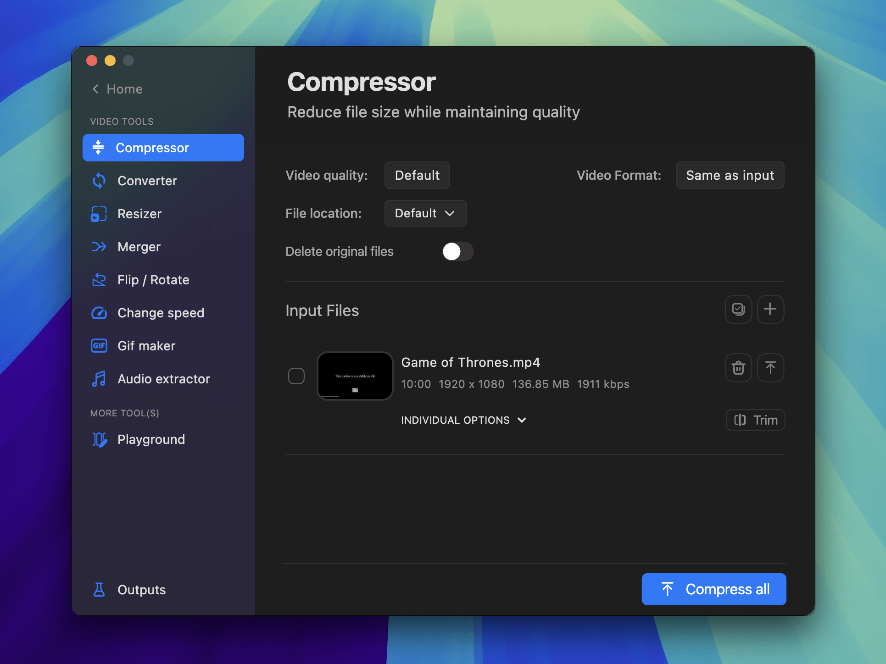

# Pimosa
Repository for macOS builds of the Pimosa app.

### Pimosa: Simple Video, Photo & Music Editing Tools in one app. 

Convert, edit, and enhance video, photos, and music files easily. Batch processing for faster work. simple tools for everyone.

Tools are organized into categories by file type:

#### Video Tools:
- Compress
- Merge & Combine
- Resize & Rotate
- Speed Control
- Flip & Mirror
- Convert Formats
- Extract Audio
- Trim & Cut

#### Image Tools:
- Convert Formats
- Compress
- Resize
- Crop

#### Audio Tools:
- Extract from Video
- Convert Formats
- Edit Metadata
- Create Waveform Videos

#### Video Playground:
- Crop Videos
- Combine Clips

All your essential media editing tools—in one place!

Visit the landing page for more info: [https://pimosa.app](https://pimosa.app)
